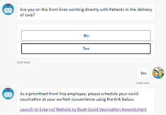
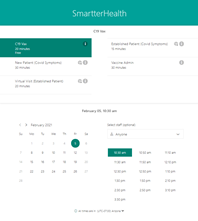
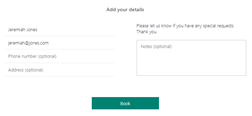
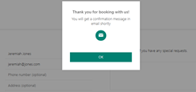
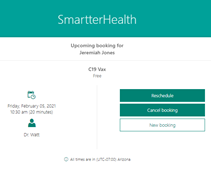

# Rightsizing Scheduling Integration with the Azure Health Bot
The Azure Health Bot is a wonderful solution for integrating conversational AI into your organization’s patient engagement strategy through direct engagement via SMS and static engagement from their web presence.  As the technical needs of the Health Bot scenarios evolve, integrating with back-end systems and processes become more important and appointment scheduling is just one example where there are many different approaches to accomplish the need.

[Microsoft Bookings](https://docs.microsoft.com/en-us/microsoft-365/bookings/bookings-overview?view=o365-worldwide) is just one of several scheduling solutions that is available to most customers and depending on the required volume or scale, makes for a quick and effective solution.  Several key advantages of using Microsoft Bookings is that it integrates seamlessly with Outlook, provides automatic email notifications, and provides a customer centric, self-service scheduling solution.  The most basic means of integration of Microsoft Bookings with the Health Bot is accomplished by providing the link to the published Bookings Calendar page from the Health Bot scenario.

Here are a few sample screen shots of how this might look starting from the Health Bot prompting a link for the user to launch into the self-service Bookings page to start the scheduling process.

 

Once the user chooses their appointment date, time and enter their contact information, their appointment is confirmed.

 

Looking for a more integrated scheduling experience?  Look no further as Microsoft has two options available.   While the Bookings API is currently in beta, we will showcase that option first and then showcase the Shifts API.  Both solutions have its pros and cons and while sample scenarios will be published to GitHub, extensive testing needs to occur before either of these approaches can be implemented in production.

The [Bookings API](https://docs.microsoft.com/en-us/graph/api/resources/booking-api-overview?view=graph-rest-beta) is currently in beta and is primarily targeted towards the administrative aspects of managing the Bookings calendar.  But through some creativity and JavaScript, the Health Bot can provide an integrated scheduling experience with Bookings.

Here are a few sample screen shots of how this might look starting from the Health Bot prompting for customer information, choosing a location and then the prompting for dates and times for the two vaccination appointments.

  

The [Shifts App](https://docs.microsoft.com/en-us/microsoftteams/expand-teams-across-your-org/shifts/manage-the-shifts-app-for-your-organization-in-teams) in Teams is another scheduling solution that is available for organizations to take advantage of.  The approach is similar but requires a bit more up front work to get the desired staffing model configured within Shifts.  Here is an example of what Shifts might look like on a small scale once configured.

Just like the bookings example above, let’s see how this would look within Shifts.

 

Scheduling integration with the Azure Health Bot is not a one size fits all approach.  While this post has highlighted the use of Bookings and Shifts, large scale enterprise implementations will benefit greatly by HL7 FHIR integration with an EHR or Practice Management System.

For smaller implementation scopes, one key advantage of using Microsoft Bookings is that it integrates seamlessly with Outlook, provides automatic email notifications to customers, and provides a customer centric, self-service scheduling solution.  Unfortunately, the beta release of the Bookings API would mean that it would not be supported in a production implementation.  One key advantage of using Shifts in Teams is that it would work well to keep Outlook calendars clean in cases where this is being considered for “ad hoc” events such as a vaccination clinic.

Steps to implement either of these integrated experiences are quite involved so we’ve provided sample health bot scenarios and some basic implementation details on Git for your review and adaptation.  You can find that here. <link to be added>
